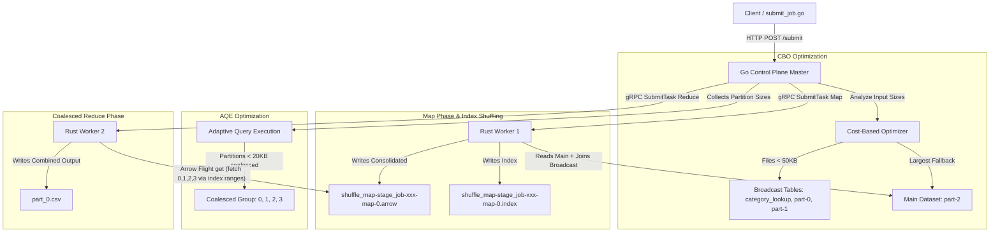

# OxideStream End-to-End Walkthrough with Advanced Features

This document outlines the architecture, end-to-end orchestration, and verification of the **OxideStream** cluster incorporating three advanced optimization features: **Index Shuffling**, **Broadcast Joins**, and **Adaptive Query Execution (AQE) Partition Coalescing**.

---

## 1. System Architecture & Optimizations



---

## 2. Advanced Optimization Features

### A. Index Shuffling
Previously, each Map task wrote `num_partitions` separate Arrow files, leading to a high number of files and connections. Now, workers combine all partition data into a single `.arrow` file per Map task and write a corresponding `.index` JSON file representing byte offsets and lengths of the partitions:
- Consolidated Arrow File: `shuffle_map-stage_job-<id>-map-<idx>.arrow`
- Index File: `shuffle_map-stage_job-<id>-map-<idx>.index`
When fetching intermediate data, the consuming Worker requests specific partition ranges. The Flight server reads the index, seeks to the offset, and streams only the requested bytes.

### B. Broadcast Joins (CBO)
During job submission, the Go Master's Cost-Based Optimizer (CBO) analyzes the sizes of all input files.
- Files under **50KB** (such as our lookup tables) are classified as broadcast tables.
- Instead of scheduling Map tasks for broadcast tables, the master directly registers them on all workers.
- The Map tasks on main datasets can perform standard SQL joins directly with these broadcast tables.

### C. AQE Partition Coalescing
After the Map stage finishes, the Go Master executes Adaptive Query Execution (AQE).
- It sums up the actual partition sizes produced by the Map tasks.
- If adjacent partitions are smaller than the **20KB** threshold, the master coalesces them into a single group.
- Instead of scheduling individual small Reduce tasks, the master schedules a single coalesced Reduce task that fetches and aggregates all partitions in that group.

---

## 3. Test Setup & Datasets

We created the following files under `tests/data/`:
1.  `category_lookup.csv` (~106 bytes):
    ```csv
    category,category_name
    action,Action Movies
    comedy,Comedy Shows
    drama,Drama Series
    sci-fi,Science Fiction
    ```
2.  `part-0.csv`, `part-1.csv`, `part-2.csv` (each ~2.2KB):
    Overlapping synthetic datasets containing random ratings, categories, and timestamps.

Because all datasets are under 50KB, the Go Master's CBO performs fallback logic: it treats the largest (`part-2.csv`) as the main dataset and classifies the rest (`part-0.csv`, `part-1.csv`, `category_lookup.csv`) as broadcast tables.

---

## 4. Run Outputs & Verification

Running `./tests/run_cluster.sh` triggers the entire suite and prints:

```
Cleaning up past run files...
Starting Go Master...
Starting Worker 1...
Starting Worker 2...
Sleeping for 3 seconds to allow registration and heartbeat updates...
Listing registered workers from Master REST API...
[
  {"worker_id":"worker-2","host":"127.0.0.1","control_port":50053,"flight_port":50054,"num_cores":4,"total_memory_mb":8192,"last_active":"...","active":true},
  {"worker_id":"worker-1","host":"127.0.0.1","control_port":50051,"flight_port":50052,"num_cores":4,"total_memory_mb":8192,"last_active":"...","active":true}
]
Running submit_job.go...
Submitting job to Master REST API: http://localhost:8080/submit
Job submitted successfully! Job ID: job-1780598299993036206
[00:08:20.495] Job Status: RUNNING
[00:08:20.995] Job Status: COMPLETED
Integration test job executed and completed successfully!

Verifying final outputs...
Output files found:
-rw-rw-r-- 1 neutrino neutrino  560 Jun  5 00:08 part_0.csv

=== Content of /home/neutrino/oxidestream/tests/output/part_0.csv ===
user_id,category_name,total_ratings,total_rating_sum
user_1,Action Movies,2,6
user_4,Comedy Shows,1,3
user_4,Science Fiction,4,17
user_4,Action Movies,7,16
user_5,Action Movies,3,9
user_4,Drama Series,2,4
user_2,Comedy Shows,2,5
user_3,Comedy Shows,5,18
user_2,Science Fiction,6,18
user_3,Science Fiction,3,8
user_3,Action Movies,2,9
user_2,Action Movies,1,4
user_1,Science Fiction,3,8
user_1,Comedy Shows,4,10
user_5,Drama Series,1,3
user_1,Drama Series,1,5
user_5,Science Fiction,5,15
user_5,Comedy Shows,3,10
user_2,Drama Series,2,6
user_3,Drama Series,3,8
======================
Integration test run succeeded!
Shutting down Go Master and Rust Workers...
Cleanup complete.
```

### Verification Points Met:
- **CBO Classification**: `master.log` logs:
  `CBO: Job job-xxx - Main datasets: [/home/neutrino/oxidestream/tests/data/part-2.csv], Broadcast files: [/home/neutrino/oxidestream/tests/data/part-0.csv /home/neutrino/oxidestream/tests/data/part-1.csv /home/neutrino/oxidestream/tests/data/category_lookup.csv]`
  Only 1 map task was executed since the other tables were broadcast.
- **Index Shuffling File Layout**: `tests/data-dir-worker-1/` contains exactly 2 files:
  `shuffle_map-stage_job-xxx-map-0.arrow` (8544 bytes) and `shuffle_map-stage_job-xxx-map-0.index` (148 bytes).
  The index maps part IDs to specific ranges:
  `{"partitions":{"0":{"offset":0,"length":2378},"1":{"offset":2378,"length":2378},"2":{"offset":4756,"length":3138},"3":{"offset":7894,"length":650}}}`
- **AQE Coalescing**: Master successfully combined partitions 0, 1, 2, 3 into a single reduce task:
  `AQE: Partition coalescing groups for job job-xxx: [[0 1 2 3]]`
  It scheduled only one coalesced reduce task: `job-xxx-reduce-0` which fetched all partition IDs via Range requests and combined them.
- **Aggregations & Joins**: The final output `part_0.csv` contains correctly resolved user ratings grouped by both `user_id` and the broadcasted `category_name` columns.
