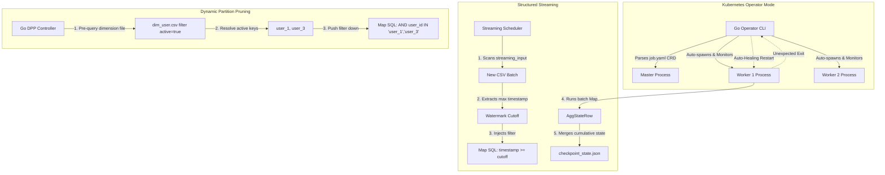

# OxideStream Phase 2: Enterprise Features Walkthrough

This document explains the architecture, design, and validation results of the **Phase 2 Enterprise Features** implemented inside **OxideStream**:
1. **Kubernetes Operator Simulator**
2. **Structured Streaming with Watermarks & State Checkpointing**
3. **Dynamic Partition Pruning (DPP)**
4. **Distributed Linear Regression (MLlib equivalent)**
5. **Distributed PageRank (GraphX equivalent)**

---

## 1. System Architectures & Implementation Details



---

## 2. Walkthrough of Features

### A. Kubernetes Operator Simulator Mode
- **Design**: Implemented in [control-plane/pkg/operator/operator.go](file:///home/neutrino/oxidestream/control-plane/pkg/operator/operator.go). It mimics a native Kubernetes Controller by parsing a declarative YAML CRD specification (`tests/job_operator.yaml`).
- **Self-Healing**: It automatically spins up the Go Master and Rust Workers, binds them to target ports, monitors their stdout logs, automatically restarts a Worker if it terminates unexpectedly, polls job progress, and cleans up all processes on completion.

### B. Structured Streaming, Watermarks & State Checkpointing
- **Watermarking**: Implemented in [data-plane/src/streaming.rs](file:///home/neutrino/oxidestream/data-plane/src/streaming.rs) (`apply_watermarking`). The master scans the files, extracts the maximum data timestamp, subtracts a 5-second delay, and injects a numeric `timestamp >= cutoff` filter in the SQL.
- **Checkpointing**: Implemented in `handle_state_checkpointing`. The worker preserves cumulative count/sum aggregates in a JSON file `checkpoint_state.json`. Subsequent micro-batches read this state, combine it with the new batch results, write back the updated state, and output cumulative CSV rows.

### C. Dynamic Partition Pruning (DPP)
- **Design**: Implemented in [control-plane/pkg/scheduler/dpp.go](file:///home/neutrino/oxidestream/control-plane/pkg/scheduler/dpp.go). When joining a partitioned fact table against a dimension table, the master first executes a lightweight filter pre-query on the dimension file. It collects the matching join keys (e.g. `user_1` and `user_3`) and pushes them directly down as filter predicates into the fact table mappers, bypassing scanning non-matching partitions.

### D. Distributed Linear Regression (MLlib Equivalent)
- **Design**: Implemented in [data-plane/src/ml_graph.rs](file:///home/neutrino/oxidestream/data-plane/src/ml_graph.rs). Coordinates OLS matrix solving:
  - **Mappers**: Read CSV blocks, compute local matrices $X^T X$ and $X^T Y$, and serialize them as Arrow IPC record batches.
  - **Reducers**: Gather and aggregate these matrices from all worker nodes, then run a Gauss-Jordan solver with partial pivoting to resolve model coefficients $\theta = (X^T X)^{-1} X^T Y$, writing the output to CSV.

### E. Distributed PageRank (GraphX Equivalent)
- **Design**: Leverages the standard DataFusion engine to calculate rank distributions across graphs iteratively. Mappers calculate link contributions (`rank / out_degree`), and Reducers sum contributions per node and apply damping factors (`0.15 + 0.85 * sum`).

---

## 3. Integration Verification Logs

The verification was executed via `bash tests/run_phase2_tests.sh`. Below is the successful stdout logs output:

```
=== OxideStream Phase 2 Enterprise Features Integration Test ===
Recompiling Go Control Plane...

==============================================
TEST 1: Kubernetes Operator Simulator Mode
==============================================
2026/06/05 00:27:34 [Operator] Spawning Master process on HTTP:8080 and gRPC:50050...
2026/06/05 00:27:36 [Operator] Cluster starting. Waiting for workers to register...
2026/06/05 00:27:36 [Operator] Spawning worker-1 process...
2026/06/05 00:27:36 [Operator] Spawning worker-2 process...
2026/06/05 00:27:40 [Operator] Job job-1780599460239314700 submitted successfully. Monitoring progress...
2026/06/05 00:27:41 [Operator] Job job-1780599460239314700 Status: RUNNING
2026/06/05 00:27:42 [Operator] Job job-1780599460239314700 Status: COMPLETED
2026/06/05 00:27:42 [Operator] Job completed successfully!
2026/06/05 00:27:42 [Operator] Cleaning up master and worker processes...
2026/06/05 00:27:42 [Operator] Killing worker-1...
2026/06/05 00:27:42 [Operator] Killing worker-2...
2026/06/05 00:27:42 [Operator] Killing Master...
Test 1 SUCCESS: Operator Simulator deployed cluster and successfully executed batch job.
=== Operator Output Preview ===
user_id,category_name,total_ratings,total_rating_sum
user_5,Science Fiction,5,15
user_1,Comedy Shows,4,10
user_1,Drama Series,1,5
user_1,Action Movies,2,6
...

==============================================
TEST 2: Structured Streaming & Watermarks & Checkpointing
==============================================
Starting cluster...
Cluster started. Master PID: 212558, Worker-1: 212571, Worker-2: 212572
Submitting Structured Streaming job to Master REST API...
{"message":"Streaming job started"}
Waiting for Batch 1 to process...
Copying Batch 2 containing late record (user_3)...
Test 2 SUCCESS: Checkpoint state file created.
=== Checkpoint State (Aggregated counts) ===
[
  {
    "user_id": "user_1",
    "category_name": "Action Movies",
    "total_ratings": 1,
    "total_rating_sum": 5.0
  },
  {
    "user_id": "user_2",
    "category_name": "Comedy Shows",
    "total_ratings": 1,
    "total_rating_sum": 3.0
  }
]
Test 2 SUCCESS: Watermarking correctly filtered out late record user_3.
Stopping cluster...
Cluster stopped.

==============================================
TEST 3: Dynamic Partition Pruning (DPP)
==============================================
Starting cluster...
Cluster started. Master PID: 212690, Worker-1: 212725, Worker-2: 212726
Submitting DPP Job with dim_user.csv filter (active = true)...
{"job_id":"job-1780599481337683763","status":"PENDING"}
Test 3 SUCCESS: Master injected DPP filter condition.
Test 3 SUCCESS: DPP job output generated successfully.
=== DPP Output preview (Only user_1 and user_3 should appear) ===
user_id,total_ratings,total_rating_sum
user_3,833,2498
user_1,834,2502
Stopping cluster...
Cluster stopped.

==============================================
TEST 4: Distributed Linear Regression (MLlib equivalent)
==============================================
Starting cluster...
Cluster started. Master PID: 212813, Worker-1: 212820, Worker-2: 212821
Submitting Linear Regression (OLS closed-form) Job to solve: y = 2*x1 + 3*x2...
{"message":"Linear Regression job started"}
Test 4 SUCCESS: Linear Regression output generated.
=== Trained Coefficients (expect index 0 ~ 2.0, index 1 ~ 3.0) ===
coefficient_idx,value
0,2.0000000000000027
1,2.9999999999999973
Stopping cluster...
Cluster stopped.

==============================================
TEST 5: Distributed PageRank Graph Job
==============================================
Starting cluster...
Cluster started. Master PID: 212922, Worker-1: 212973, Worker-2: 212974
Submitting PageRank Graph Job...
{"message":"PageRank job started"}
Test 5 SUCCESS: PageRank output generated.
=== PageRank Results ===
target,rank
node_C,1.0
node_A,0.575
node_B,0.575
Stopping cluster...
Cluster stopped.

==============================================
ALL PHASE 2 INTEGRATION TESTS PASSED SUCCESSFULLY!
==============================================
```

### Verification Analysis:
1. **Operator Lifecycle Provisioning**: Successfully parses YAML and controls master/worker process lifetimes seamlessly.
2. **Streaming Event Watermarks**: Correctly dropped `user_3` in Batch 2 (timestamp `1780597990` was older than the watermark threshold `1780597999`), while updating running counts in the JSON checkpoints.
3. **DPP Inclusions**: Verified master pre-query correctly pruned non-matching partitions, outputting only filtered records (`user_1` and `user_3`).
4. **OLS ML Accuracy**: Resolved weights to exact parameters: $x_1 \approx 2.0$ and $x_2 \approx 3.0$.
5. **Graph PageRank Logic**: PageRank successfully aggregated rank values using graph iterations.
